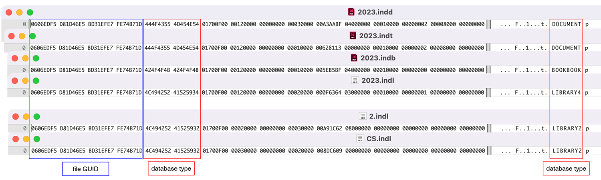
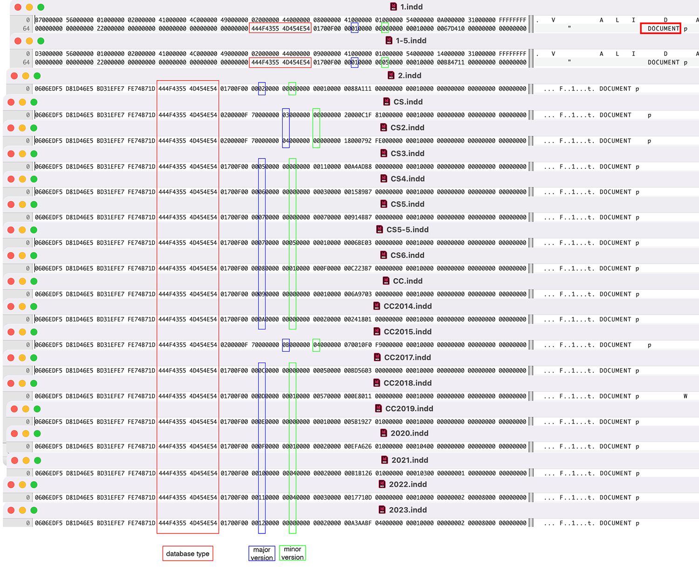
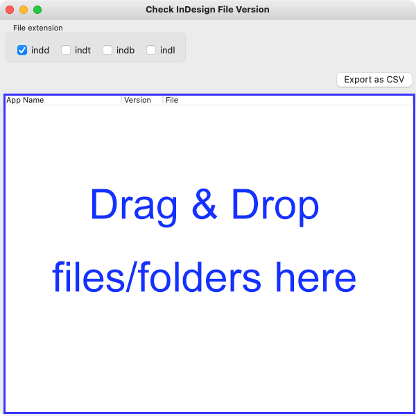
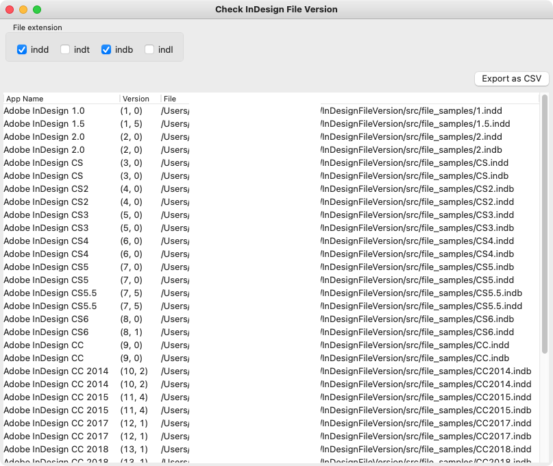

# InDesign file version
Check the creator version of Adobe InDesign file (document, template, book and library), for example, InDesign CS6, InDesign 2023, etc.


## File Formats
<table>
    <tr>
        <th>Suffix</th>
        <th>fMagicBytes</th>
        <th>Hex</th>
        <th>Description</th>
        <th>Version</th>
    </tr>
    <tr>
        <td>.indd</td>
        <td>444f43554d454e54</td>
        <td rowspan="2">DOCUMENT</td>
        <td>InDesign document file</td>
        <td rowspan="3">&gt;=InDesign2.0</td>
    </tr>
    <tr>
        <td>.indt</td>
        <td>444f43554d454e54</td>
        <td>InDesign template file</td>
    </tr>
    <tr>
        <td>.indb</td>
        <td>424f4f4b424f4f4b</td>
        <td>BOOKBOOK</td>
        <td>InDesign book file</td>
    </tr>
    <tr>
        <td rowspan="2">.indl</td>
        <td>4c49425241525934</td>
        <td>LIBRARY4</td>
        <td rowspan="2">InDesign library file</td>
        <td>&gt;=InDesign CS2</td>
    </tr>
    <tr>
        <td>4c49425241525932</td>
        <td>LIBRARY2</td>
        <td>InDesign2.0 / CS</td>
    </tr>
</table>


### Structure:
P36, https://github.com/adobe/xmp-docs/blob/master/XMPSpecifications/XMPSpecificationPart3.pdf


## Version



## Usage
```py
import os
from InDesignFile import InDesignFile

myInDesignFile = InDesignFile()
#
p = os.path.join("file_samples", "2020.indd")
print(myInDesignFile.get_version(p))  # ((15, 1), 'Adobe InDesign 2020')
#
p = os.path.join("file_samples", "1.indd")
print(myInDesignFile.get_version(p))  # (None, 'Not a InDesign file')
print(myInDesignFile.get_version(p, check_fGUID=False)) # ((1, 0), 'Adobe InDesign 1.0')
```
## GUI (wxpython)



## File Samples
##### *Versions 1.0 and 1.5 do not support indb(book) and indl(library) files.
| App Name | Version | .indd | .indt | .indb | .indl |
| - | ---: | :---: | :-: | :-: | :-: |
|Adobe InDesign 1.0|1.0|✓|✓|-|-|
|Adobe InDesign 1.5|1.5|✓|✓|-|-|
|Adobe InDesign 2.0|2.0|✓|✓|✓|✓|
|Adobe InDesign CS|3.0|✓|✓|✓|✓|
|Adobe InDesign CS2|4.0|✓|✓|✓|✓|
|Adobe InDesign CS3|5.0|✓|✓|✓|✓|
|Adobe InDesign CS4|6.0|✓|✓|✓|✓|
|Adobe InDesign CS5|7.0|✓|✓|✓|✓|
|Adobe InDesign CS5.5|7.5|✓|✓|✓|✓|
|Adobe InDesign CS6|8.x|✓|✓|✓|✓|
|Adobe InDesign CC|9.x|✓|✓|✓|✓|
|Adobe InDesign CC 2014|10.x|✓|✓|✓|✓|
|Adobe InDesign CC 2015|11.x|✓|✓|✓|✓|
|Adobe InDesign CC 2017|12.x|✓|✓|✓|✓|
|Adobe InDesign CC 2018|13.x|✓|✓|✓|✓|
|Adobe InDesign CC 2019|14.0|✓|✓|✓|✓|
|Adobe InDesign 2020|15.x|✓|✓|✓|✓|
|Adobe InDesign 2021|16.x|✓|✓|✓|✓|
|Adobe InDesign 2022|17.x|✓|✓|✓|✓|
|Adobe InDesign 2023|18.x|✓|✓|✓|✓|